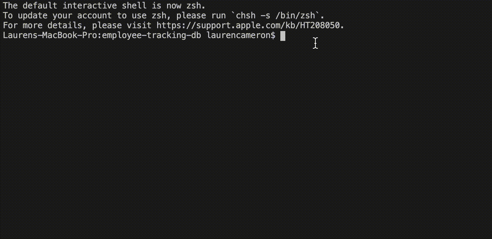
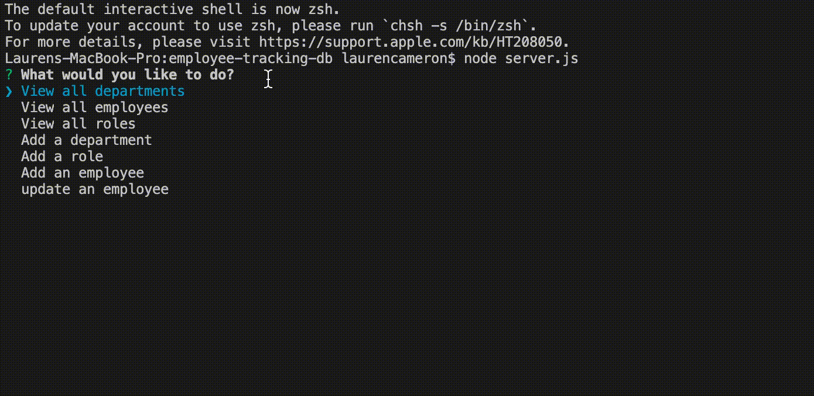
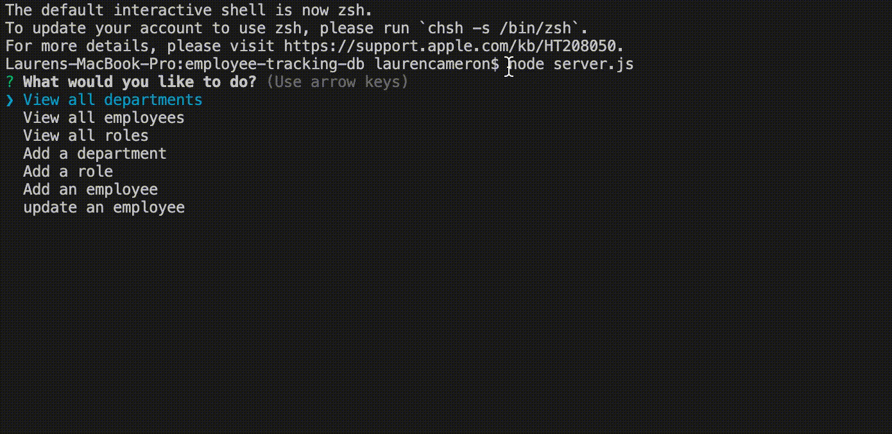
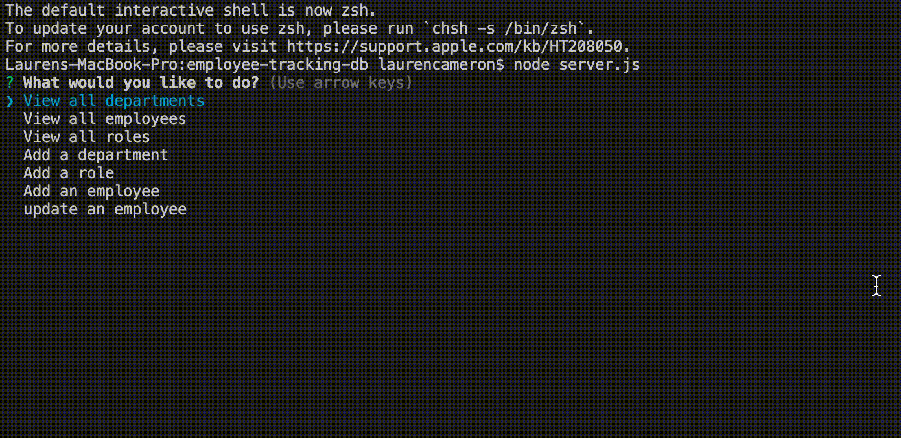
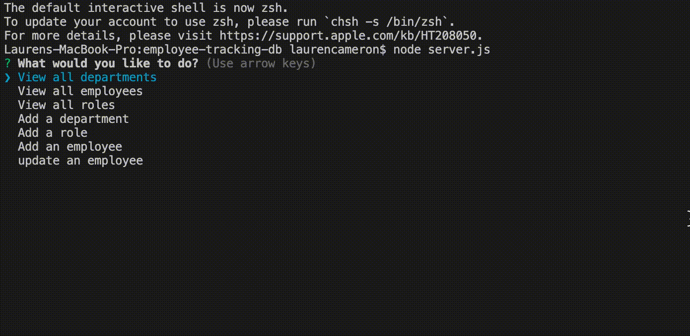
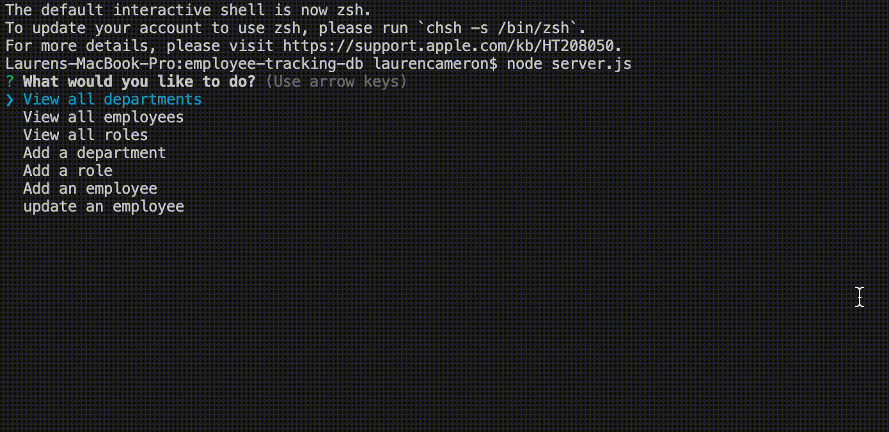

# Employee Tracking Database 

Employee Tracking Database is a Node command line application that allows users to create and connect to a database to store all employee information. This content management system uses inquierer and MySQl to prompt the user for what information they would like to input or recieve. 

Information is stored in three tables. 
* DEPARTMENTS table keeps track of the different department names
* ROLE table keeps the info of the title, salary, ID for the role, and department ID
* EMPLOYEE table keeps track of employee ID, first name, last name, role ID, and manager ID.

## User Story 

```
As a business owner
I want to be able to view and manage the departments, roles, and employees in my company
So that I can organize and plan my business
```

## How to use

After creating a databse using the provided schema, iniitialize the program with `node server.js`



### View departments, roles or employees  



### Add a new department 



### Add a new role



### Add a new employee



### Update the role of an employee 




## Future Development 

The current application is fully functional, but in the future additional features would incrase the usefullness of the app:

  * Update employee managers

  * View employees by manager

  * Delete departments, roles, and employees

  * View the total utilized budget of a department -- ie the combined salaries of all employees in that department

## Credits 


* MySQL npm pacakge to connect to your MySQL database and perform queries
[MySQL](https://www.npmjs.com/package/mysql)

* InquiererJs NPM package to interact with the user via the command-line
[InquirerJs](https://www.npmjs.com/package/inquirer/v/0.2.3) 

* Console.table is used to print more readable MySQL rows to the console
[console.table](https://www.npmjs.com/package/console.table) 

